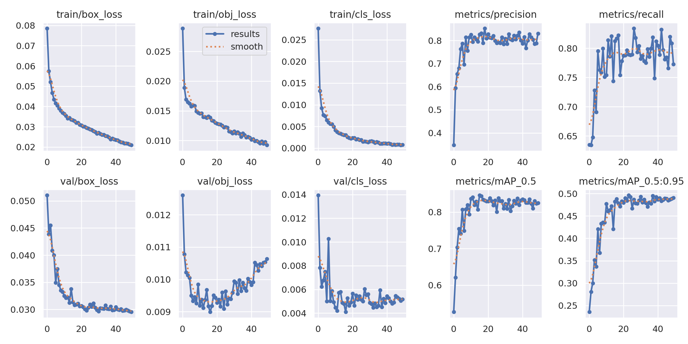
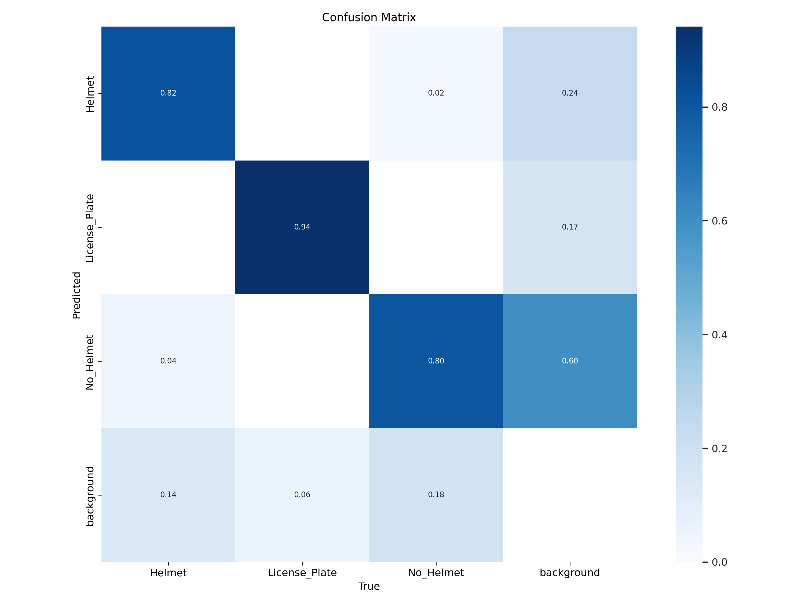
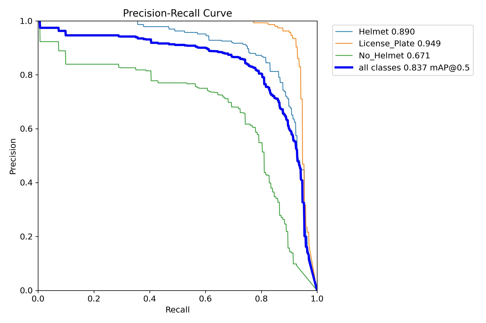
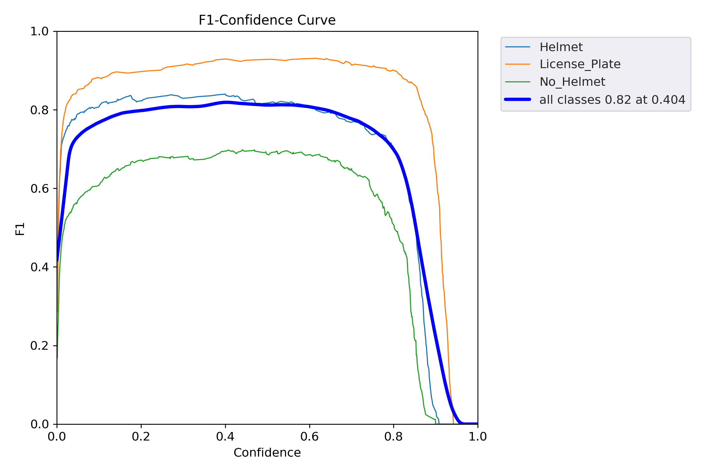
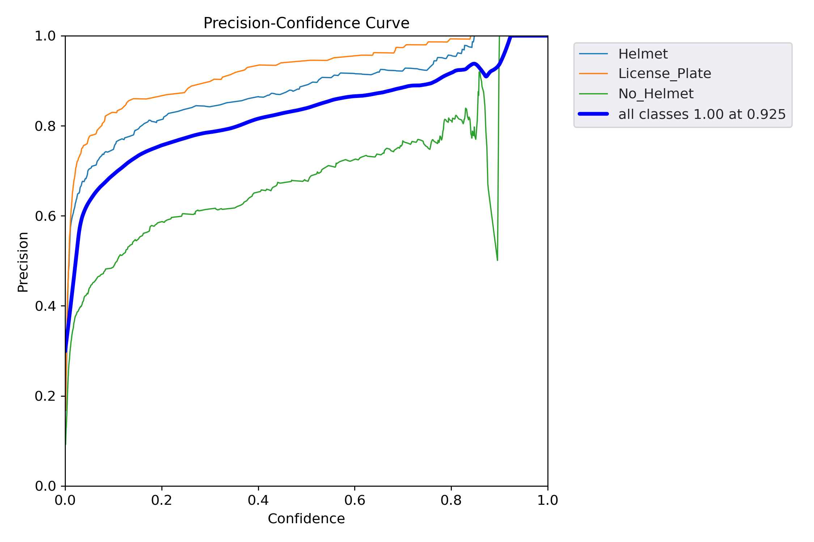
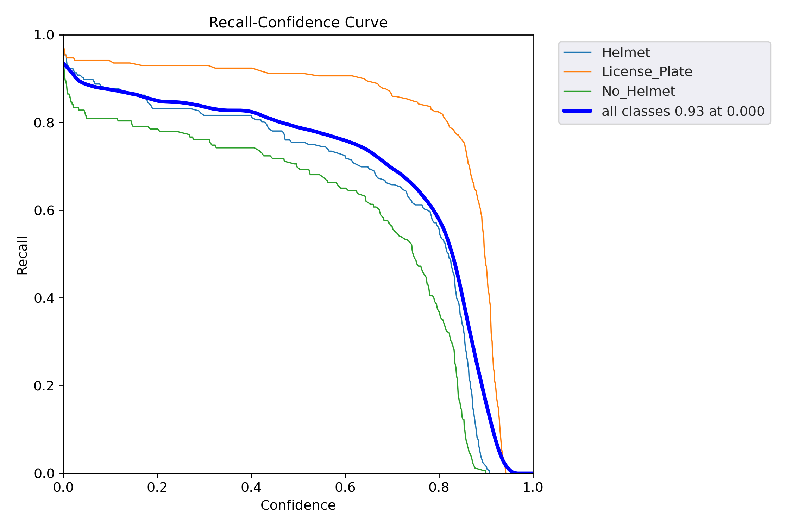
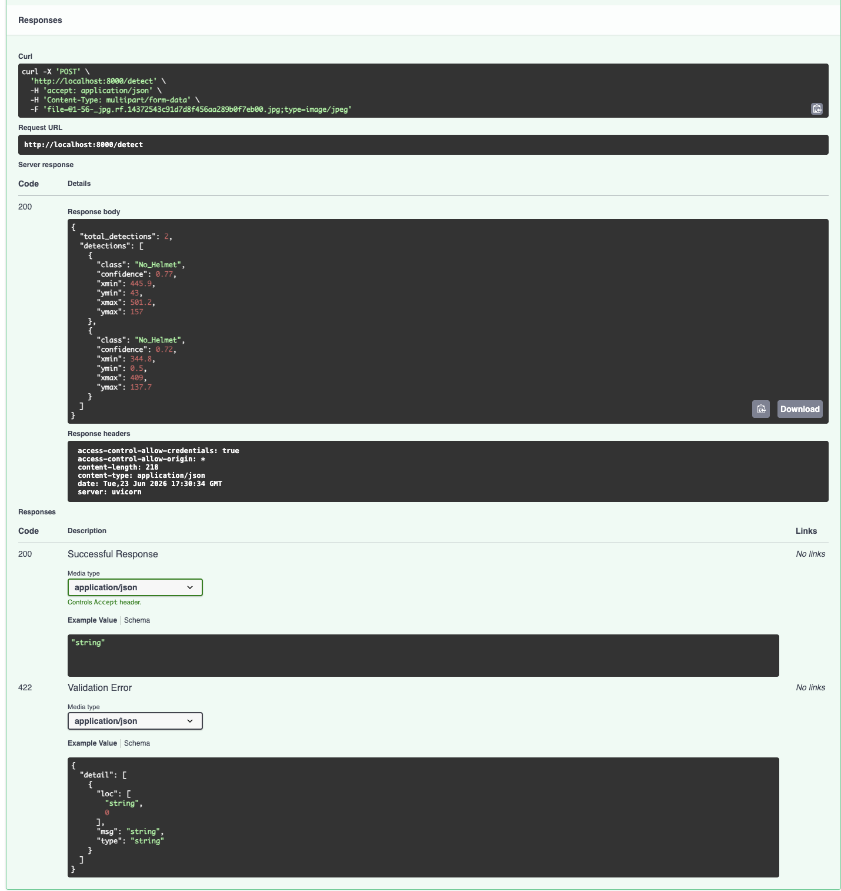
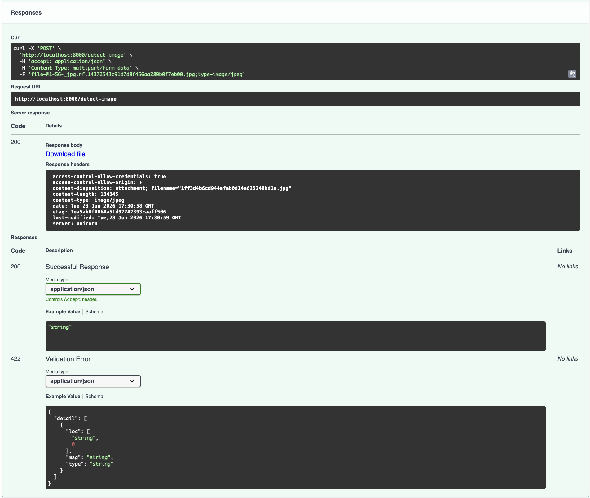

# 🚦 SafeCityAI — Traffic Violation Detection using YOLOv5

---

## 📌 Project Overview

SafeCityAI is an AI-powered traffic monitoring system that automates traffic rule enforcement using Computer Vision and Deep Learning. Traditional traffic monitoring requires manual review of CCTV footage, which is time-consuming and inefficient. SafeCityAI uses a custom-trained YOLOv5 object detection model to automatically detect:

- 🪖 **Helmet** — rider wearing a helmet
- ❌ **No_Helmet** — rider without a helmet (violation)
- 🔢 **License_Plate** — vehicle license plate

The system exposes a FastAPI REST API that accepts an image and returns both JSON detection results and an annotated image with bounding boxes drawn.

---

## 🎯 Problem Statement

Traffic authorities spend thousands of hours manually reviewing surveillance footage to identify violations. The objective of this project is to:

- Detect riders wearing helmets
- Detect riders without helmets (violations)
- Detect and locate license plates
- Automate traffic violation monitoring
- Provide real-time detection results through a deployable API

---

## 🛠️ Tech Stack

| Category | Tools |
|---|---|
| Language | Python 3.12 |
| Deep Learning | YOLOv5, PyTorch |
| Computer Vision | OpenCV, Pillow |
| Dataset & Annotation | Roboflow |
| Backend API | FastAPI, Uvicorn |
| Deployment | Docker |
| Training Platform | Kaggle (Tesla T4 GPU) |

---

## 📂 Dataset

The dataset was collected and annotated using Roboflow, merged from two sources: a Vietnamese motorbike dataset and a Bikes/Helmets dataset.
**RoboFlow Dataset Project**:- https://app.roboflow.com/naina-vismi/helmet-and-no-helmet-rider-detection-qkyda/1


### Classes

| Class ID | Class Name |
|---|---|
| 0 | Helmet |
| 1 | License_Plate |
| 2 | No_Helmet |

### Dataset Split

| Split | Images |
|---|---|
| Train | ~700 |
| Validation | ~200 |
| Test | 309 |

### Annotation Format

YOLO format — one `.txt` file per image:
```
class_id  x_center  y_center  width  height
```
All coordinates are normalized (0 to 1) relative to image dimensions.

### Dataset Processing

- Manual annotation using Roboflow
- Data augmentation (flip, brightness, mosaic)
- Train / Validation / Test split

---

## 🧠 Model Architecture

**YOLOv5s** (You Only Look Once v5 Small)

### Training Strategy

**Kaggle Notebook**: https://www.kaggle.com/code/nainavismi/safecityai-detection-system

- Transfer Learning from COCO pre-trained weights (`yolov5s.pt`)
- Fine-tuning on custom traffic dataset
- Best weights saved from epoch 26 out of 50 epochs trained

### Hyperparameters

| Parameter | Value |
|---|---|
| Image Size | 640 × 640 |
| Batch Size | 16 |
| Epochs Trained | 50 |
| Best Epoch | 26 |
| Optimizer | SGD |
| Confidence Threshold | 0.25 |
| IoU Threshold | 0.45 |
| Framework | PyTorch |

---

## 📊 Model Performance

Results from best checkpoint (`best.pt`, epoch 26):

| Class | Images | Instances | Precision | Recall | mAP@0.5 | mAP@0.5:0.95 |
|---|---|---|---|---|---|---|
| **All** | 309 | 530 | 0.812 | 0.843 | **0.860** | 0.493 |
| Helmet | 309 | 196 | 0.785 | 0.857 | 0.884 | 0.559 |
| License_Plate | 309 | 171 | 0.871 | 0.918 | 0.957 | 0.612 |
| No_Helmet | 309 | 163 | 0.730 | 0.614 | 0.683 | 0.322 |

**Inference Speed: 7.4ms per frame (~135 fps) on Tesla T4 GPU — real-time capable.**

### Class Analysis

- **License_Plate** performs best (mAP50: 0.957) — high visual consistency
- **Helmet** performs well (mAP50: 0.884) — good variety in training data
- **No_Helmet** is the weakest class (recall: 0.614) — higher visual variability (hair, head angle, partial occlusion). Compensated at inference via confidence threshold tuning

---

## 📈 Training Results

### Loss & Metrics Curves


### Confusion Matrix


### Precision-Recall Curve


### F1 Score Curve


### Precision Curve


### Recall Curve


---

## 📊 Dataset Analysis

### Label Distribution


### Label Correlogram


---

## ⚙️ API Architecture

```
Client uploads image
        ↓
   FastAPI server
        ↓
 YOLOv5 inference (best.pt)
        ↓
   Post-processing
        ↓
JSON detections  /  Annotated image
```

---

## 🚀 API Endpoints

### `GET /` — Health Check

```json
{
  "status": "SafeCityAI Detection API Running",
  "model_loaded": true
}
```

---

### `POST /detect` — JSON Detection

Accepts an image file, returns detections in JSON format.

**Request:**
```bash
curl -X POST -F "file=@image.jpg" http://localhost:8000/detect
```

**Response:**
```json
{
  "total_detections": 2,
  "detections": [
    {
      "class": "No_Helmet",
      "confidence": 0.77,
      "xmin": 445.9,
      "ymin": 43.0,
      "xmax": 501.2,
      "ymax": 157.0
    },
    {
      "class": "No_Helmet",
      "confidence": 0.72,
      "xmin": 344.8,
      "ymin": 0.5,
      "xmax": 409.0,
      "ymax": 137.7
    }
  ]
}
```

---

### `POST /detect-image` — Annotated Image

Accepts an image file, returns the same image with bounding boxes and labels drawn.

**Request:**
```bash
curl -X POST -F "file=@image.jpg" http://localhost:8000/detect-image --output result.jpg
```

**Response:** JPEG image with bounding boxes drawn on all detections.

---

## 📷 Sample Detection Output

### JSON Response


### Annotated Image Output


---

## 🎥 Demo Video

A 30-second demo video (`synthetic_video.mp4`) shows the model running inference frame-by-frame on 75 unseen test images, with bounding boxes drawn in real time across all three classes.

---

## 🐳 Docker Support

### Build Image
```bash
docker build -t safecityai .
```

### Run Container
```bash
docker run -p 8000:8000 safecityai
```

---

## ▶️ Running the Project Locally

### 1. Clone the repository
```bash
git clone <repository-url>
cd "Safe City AI"
```

### 2. Clone YOLOv5 (pinned to v7.0)
```bash
git clone --depth 1 --branch v7.0 https://github.com/ultralytics/yolov5.git
```

### 3. Create and activate virtual environment
```bash
python3.12 -m venv .venv
source .venv/bin/activate   # Mac/Linux
# OR
.venv\Scripts\activate      # Windows
```

### 4. Install dependencies
```bash
pip install --upgrade pip
pip install setuptools==69.5.1
pip install -r requirements.txt
```

### 5. Start the server
```bash
python server.py
```

Server runs at: `http://localhost:8000`  
Swagger docs at: `http://localhost:8000/docs`

### 6. Test the API
```bash
python test_api.py http://localhost:8000 test_image.jpg
```

---

## 📁 Project Structure

```
Safe City AI/
├── yolov5/                  # YOLOv5 v7.0 repo (cloned locally)
├── metrics/                 # Training charts
│   ├── results.png
│   ├── confusion_matrix.png
│   ├── PR_curve.png
│   ├── F1_curve.png
│   ├── P_curve.png
│   └── R_curve.png
├── dataset analysis/        # Dataset distribution charts
│   ├── labels.jpg
│   └── labels_correlogram.jpg
├── RESULT/                  # API output screenshots
│   ├── json_response.png
│   └── detect_image_output.png
├── outputs/                 # Saved annotated images from /detect-image
├── best.pt                  # Trained model weights (epoch 26, mAP50: 0.860)
├── results.csv              # Full training metrics per epoch
├── server.py                # FastAPI inference server
├── test_api.py              # API test script
├── requirements.txt         # Python dependencies
├── Dockerfile               # Docker deployment config
└── README.md
```

---

## 🔮 Future Improvements

- Real-time CCTV video stream monitoring
- Vehicle tracking across frames
- Number Plate OCR (text extraction)
- Traffic analytics dashboard
- Cloud deployment (Render / AWS)
- Smart city integration
- Automated violation alert system

---

## 👩‍💻 Author

**Naina Vismi N**

---

## ⭐ Project Highlights

- Custom YOLOv5 object detection model trained on real traffic data
- Two API endpoints: JSON detections + annotated image output
- mAP@0.5 of **86.0%** on held-out test set
- Inference speed of **7.4ms/frame** (~135 fps) — real-time capable
- End-to-end pipeline: data annotation → training → evaluation → API deployment
- Docker support for containerized deployment
- Transfer learning from COCO pre-trained weights